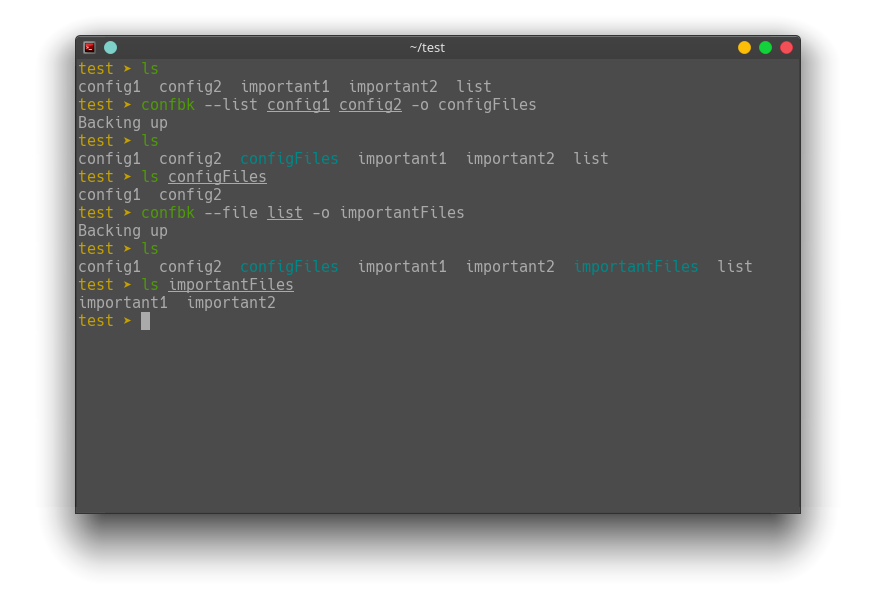
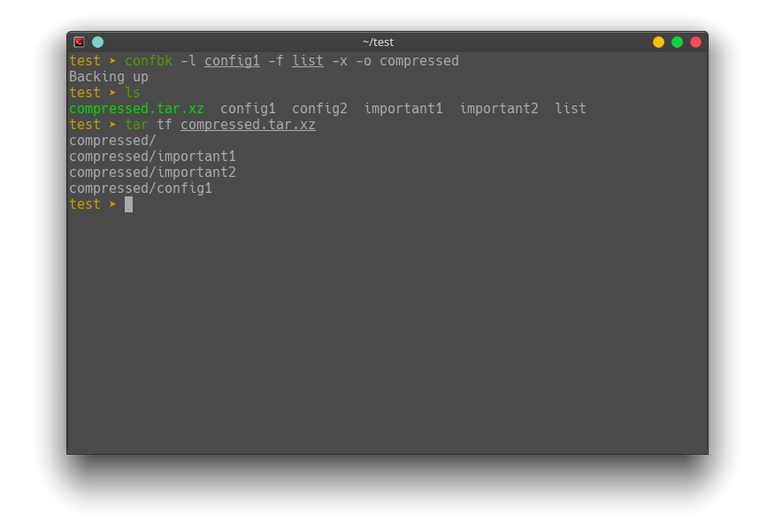
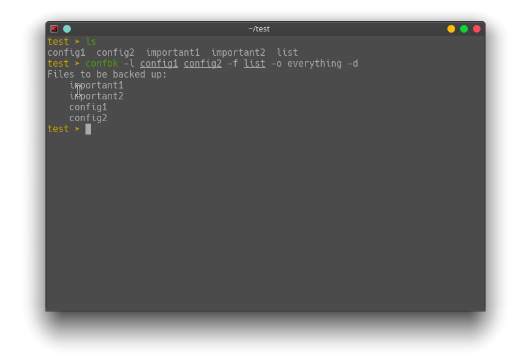

# confbk

`confbk` is a easy to use tool for backing up files

## Simple Usage

`confbk` needs either a list of files with `-l` or a file with a list of files within it `-f`. Both flags _can_ be used at the same time if need be. The `-o` flag can be used to specify a name for the directory where the configs will go. The default is `confbk-YEAR_MONTH_DAY` 

## Tar

`confbk` can also automatically tar and compress with the `-t` option 

## Dry Run

`confbk` also has a dry run feature that lets you see the files you will backup before pulling the trigger 
